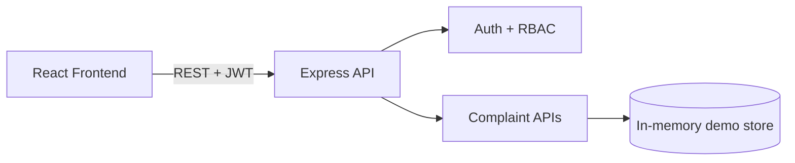

# Smart City Information Portal (Runnable MVP)

A full-stack Smart City portal with JWT auth + RBAC for:
- Citizen dashboard
- Department Admin dashboard
- Government Super Admin dashboard

## Tech Stack
- Frontend: React + TypeScript + Vite + Tailwind + Zustand + Recharts
- Backend: Node.js + Express + JWT + bcrypt + multer

## Architecture


## Core Schemas (Design)
- Users, Departments, Complaints in `docs/database-schema.md`

## Run Locally
### Backend
```bash
cd backend
npm install
npm run dev
```

### Frontend
```bash
cd frontend
npm install
npm run dev
```

Open `http://localhost:5173`.

## Demo Accounts
All demo accounts use password: `Password123!`
- citizen@smartcity.local (Citizen)
- waste.admin@smartcity.local (Department Admin)
- super.admin@smartcity.local (Super Admin)

## Implemented Endpoints
- `POST /api/v1/auth/register`
- `POST /api/v1/auth/login`
- `GET /api/v1/complaints/my` (Citizen)
- `POST /api/v1/complaints` (Citizen)
- `GET /api/v1/complaints/department` (Department Admin)
- `POST /api/v1/complaints/:id/media` (authenticated upload)

## Docker
```bash
docker compose up --build
```

## Notes
- This build is a runnable MVP using in-memory data.
- To move to production, plug in MongoDB models and persistent storage.
